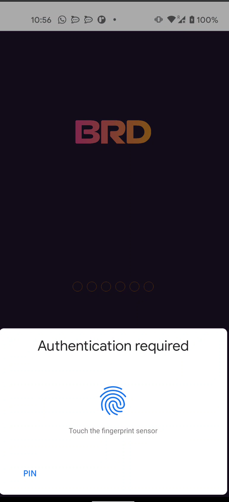

# biometrics-pin-android

El ejercicio consiste en implementar la logica de seguridad bloqueo local

- Biometrics (finger print es lo mas usual en android)
- Pin (para los que no quieran usar finger print o para default cuando no funciona los biometrics)

Pongo aquí un ejemplo de los mocks del wallet de Bread (BRD)

Requisitos:
- Usar nav library
- Poner un timer que al volver de background si pasa los 10 segundos se bloquea la aplicación (tipo app de banco)
- Poner una toggle en el home screen para desactivar / activar biometrics.
- Poner en la home screen uan forma de borrar la seguridad como si fuera logout (pero no tenemos session)

